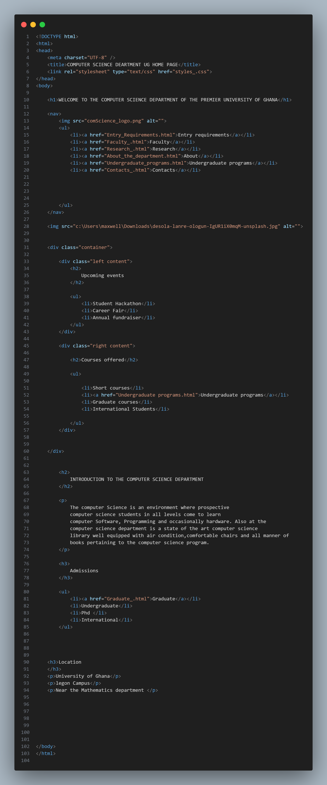

# DCIT_205_IA

My name is Maxwell Adom Sarkodie 

Student ID: 11299043
I am currently a student at the University of Ghana studying for a BSc in Computer Science

**INTRODUCTION**

I have been asked to create a 10 page website for the Computer Science department of the University of Ghana.
The purpose of this website is to help prospective computer science students navigate the various aspects of the computer science 
department and to gain credible information to aid in their program and course choices.

To start this program, I first had to fork a remote repository on github;**Danquiver/****DCIT_205_IA** 
Then I had to clone the remote repository on github, I used the git command: git clone + the url of the repository to be cloned.
After doing all of the above, I then officially start the project regularly committing and pushing
my changes as I go on to keep everything up to date on my 
copied repository on github.

**OUTLINE FOR THE WEBSITE**

**HOMEPAGE**

The first page I built as the home page

**ENTRY REQUIREMENTS PAGE**

.png>)

 

**CONTACTS PAGE**

.png>)

**ABOUT PAGE**

